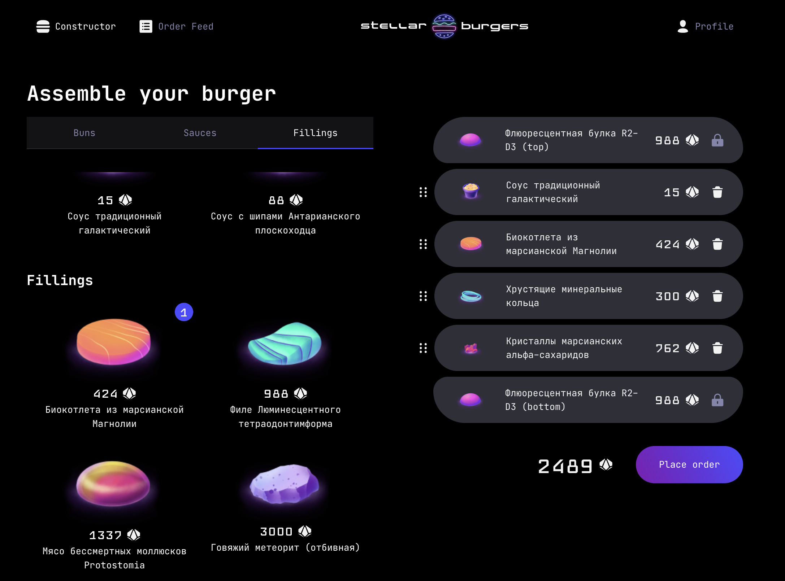
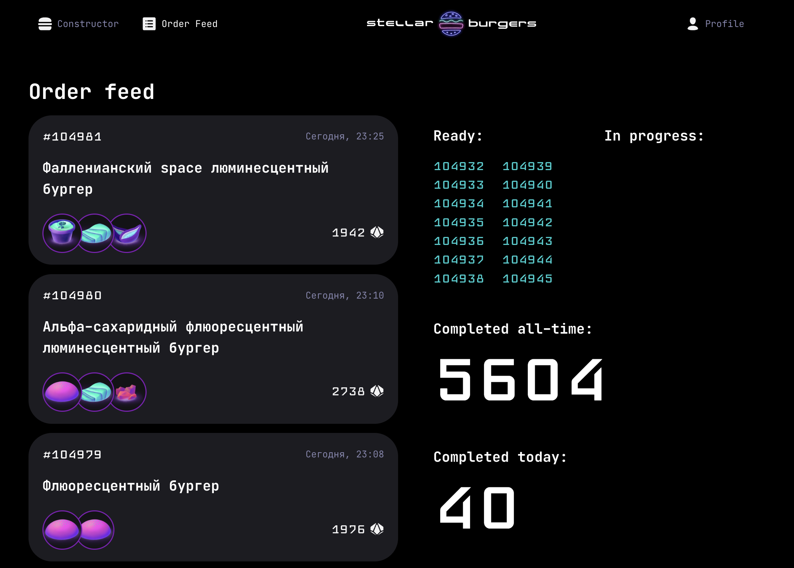
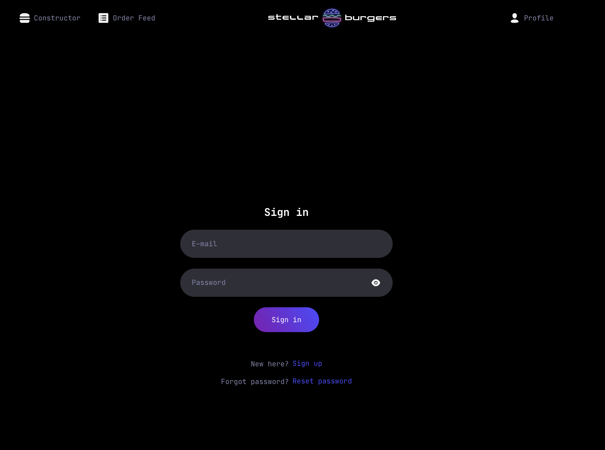

🔗 https://maratustra.github.io/react-space-burger/

# React Space Burger

> Interactive burger constructor with drag-and-drop, real-time order tracking, and full test coverage.

## Live demo





## Why this project

Users can compose custom burgers from a catalog of ingredients, place orders authenticated via JWT, and track an order feed updated in real-time via WebSockets

## Tech Stack

Built on a learning assignment spec; backend API and design system provided. All frontend architecture, state management, real-time layer, and tests are my own implementation.

**Core:** React 18, TypeScript, Redux, React Router 6
**UI & Interactions:** react-dnd, CSS Modules
**Real-time:** WebSocket (custom Redux middleware)
**Auth:** JWT with refresh-token rotation
**Testing:** Jest --> Vitest, Cypress
**Build:** Create React App --> Vite

Migrated from CRA to Vite for faster dev server startup, simpler configuration, and access to the modern ecosystem (Vitest, ESM-first tooling). CRA was officially deprecated.

## Engineering Highlights

- **Typed Redux store** — classic Redux with TypeScript discriminated-union action types and typed `useAppDispatch` / `RootState` hooks
- **Drag-and-drop constructor** — `react-dnd` with sortable ingredients (`useDrag` + `useDrop` with hover/move logic) and visual drag feedback
- **WebSocket order feed** — custom Redux middleware streams the public feed and the user's order history; auto-reconnects after JWT refresh on `Invalid or missing token` responses
- **Protected routing** — JWT auth with refresh-token rotation; `OnlyAuth` and `OnlyUnAuth` route guards for `/profile`, `/profile/orders`, and order-detail pages
- **Modal routing** — modal windows are rendered both as standalone pages (for direct URL access) and as overlays on the parent route, using React Router's `useLocation` state
- **Tests** — Vitest unit tests cover all reducers (auth, constructor, ingredients, modal, order, tabs, ws) and the store; Cypress E2E covers the burger-constructor drag-and-drop and ingredient-modal flow

## Project Structure

```
src/
├── components/        # Presentation components (modal, ingredient cards, layout)
├── pages/             # Route-level components (login, register, profile, feed, etc.)
├── services/          # Redux setup
│   ├── actions/       # Action creators
│   ├── reducers/      # Reducers (auth, constructor, ingredients, modal, order, tabs, ws)
│   └── types/         # Typed action interfaces
├── utils/             # API client, helpers, constants
└── services/store.ts  # Typed Redux hooks  
```

### Available Scripts

```bash
npm run dev            # Start the dev server at http://localhost:5173
npm run build          # Build for production
npm test               # Run Vitest in watch mode
npm run test:run       # Run Vitest once (CI mode)
npm run test:ui        # Open Vitest UI in the browser
npm run lint           # Run ESLint
npm run cypress        # Open Cypress test runner
npm run deploy         # Deploy to GitHub Pages
```

## Testing

### Unit tests (Vitest)
Reducers and store configuration are covered with unit tests:
```bash
npm test           # watch mode
npm run test:run   # single run
```

### E2E tests (Cypress)
End-to-end tests cover the burger-constructor flow: dragging ingredients, opening the ingredient detail modal, and assembling an order:
```bash
npm run cypress
```

## Roadmap

Active modernization plan for this project:
- [x] Migrate from Create React App to Vite
- [x] Migrate Jest to Vitest (reuse Vite config, faster runs, ESM-native)
- [ ] Eliminate `any` from the codebase:
  - [ ] WebSocket layer — replace `any` payloads with discriminated unions and runtime validation at the boundary
  - [ ] Tests — replace `any` with `unknown`, `Partial<T>`, or `vi.MockedFunction` where appropriate
- [ ] Refactor classic Redux to Redux Toolkit (`createSlice`, typed `PayloadAction`)
- [ ] Extend Cypress coverage to authentication and order-placement flows
- [ ] Add selector tests
- [ ] Implement true WebSocket reconnect on network drop (currently only re-dispatches after JWT refresh)
